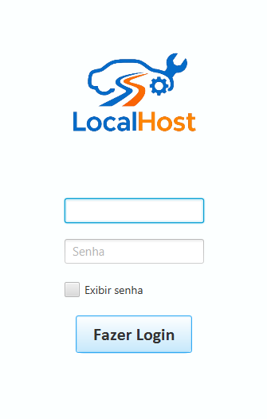
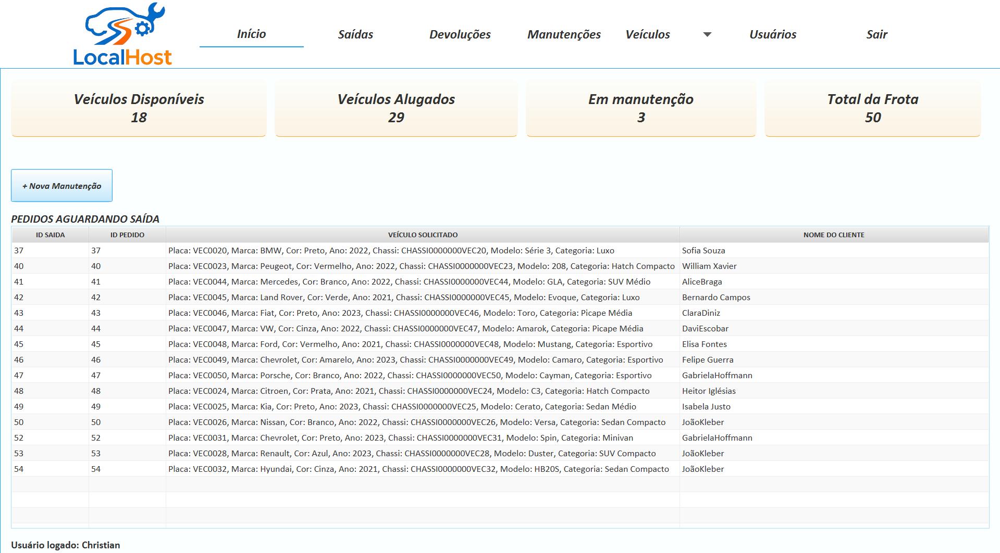
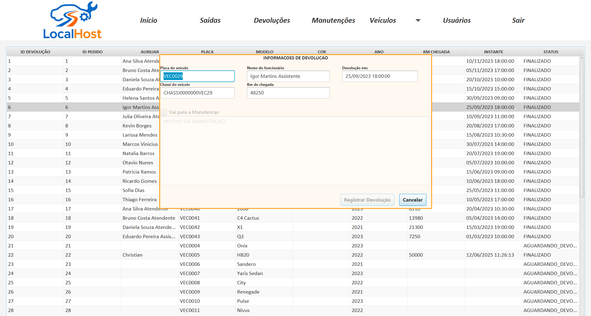
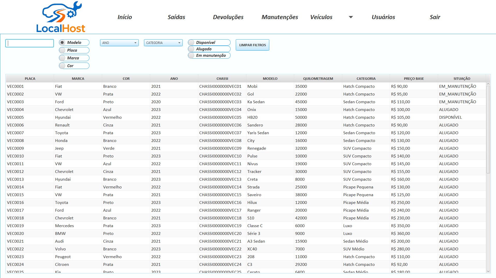

---

  Codificado com ☕ e dedicação por:
  <br>
  <strong>Linkedin:</strong> https://linkedin.com/in/christian-fernandes-50810527b. <br>
  <strong>Github-page:</strong>  https://github.com/christianfernandesprofissional


---

# LocalHost - Sistema de Gerenciamento de Frotas

   

Este repositório contém o módulo de **Gerenciamento de Frotas** do sistema da locadora de veículos **LocalHost**. Este projeto foi desenvolvido como uma aplicação desktop utilizando Java e JavaFX.

É importante notar que o sistema LocalHost é dividido em dois módulos principais que utilizam o mesmo banco de dados. O módulo de **Aluguel de Veículos**, destinado aos clientes finais e atendentes, encontra-se em um repositório separado.

## 📝 Sobre o Projeto

O módulo de Gerenciamento de Frotas é uma ferramenta interna para a equipe da LocalHost, focada em manter o controle e a organização dos veículos da empresa. O sistema possui dois níveis de acesso: **Gerente** e **Auxiliar**, cada um com permissões específicas para garantir a segurança e a eficiência dos processos.

Este projeto foi concebido como um trabalho acadêmico com o objetivo de aplicar e aprofundar conhecimentos em conceitos fundamentais do desenvolvimento de software.

---

## ✨ Funcionalidades

O sistema é dividido com base nas responsabilidades de cada cargo:

### 👨‍💼 Funcionalidades do Gerente
O Gerente possui acesso total ao sistema, com permissões para gerenciar tanto os recursos humanos quanto os materiais.
- **Gerenciamento de Usuários:**
  - Cadastrar novos usuários (Gerentes ou Auxiliares).
  - Desativar usuários existentes.
- **Gerenciamento de Frota:**
  - Cadastrar novos veículos na frota.
  - Editar informações de veículos existentes.
- **Gerenciamento de Categorias:**
  - Cadastrar novas categorias de veículos (ex: Econômico, SUV, Luxo).
  - Editar ou excluir categorias existentes.

### 🧑‍🔧 Funcionalidades do Auxiliar
O Auxiliar é responsável pela operação diária dos veículos, cuidando da logística de saídas, devoluções e manutenções.
- **Registro de Saída de Veículos:** Marcar um veículo como "Em uso" quando ele sai para um aluguel.
- **Registro de Devolução (Check-in):**
  - Receber o veículo de volta.
  - Informar se o veículo precisa de manutenção com base na sua condição.
- **Gerenciamento de Manutenção:**
  - Enviar um veículo para o status "Em Manutenção".
  - Selecionar os serviços realizados (ex: troca de óleo, alinhamento, reparo de pneu).
  - Informar o valor de cada serviço.
  - O sistema calcula automaticamente o custo total da manutenção.

---

## 🛠️ Tecnologias Utilizadas

- **Linguagem:** `Java 21`
- **Framework Gráfico:** `JavaFX`
- **IDE de Desenvolvimento:** `Apache NetBeans`
- **Banco de Dados (Produção):** `MySQL`
- **Banco de Dados (Testes):** `H2 Database`

---

## 🎯 Objetivos Acadêmicos

Este projeto foi uma oportunidade para praticar e desenvolver habilidades em:

- **Programação Orientada a Objetos (POO):** Aplicação de conceitos como encapsulamento, herança, polimorfismo e abstração para modelar o domínio do problema.
- **Java Collections Framework:** Uso eficiente de listas, mapas e conjuntos para gerenciar dados em memória.
- **Streams e Expressões Lambda:** Utilização da API de Streams para realizar operações de filtro, mapa e redução de forma declarativa e concisa.
- **Tratamento de Exceções:** Implementação de rotinas de tratamento de erros para garantir a robustez e a estabilidade da aplicação, fornecendo feedback claro ao usuário em caso de falhas (como entradas inválidas ou problemas de conexão com o banco de dados) e evitando o encerramento inesperado do sistema.

---

---

## 🚀 Começando

Siga as instruções abaixo para configurar e executar o projeto em seu ambiente local.

### Pré-requisitos

- **Java (JDK 21 ou superior)**
- **Apache NetBeans (IDE)**
- **MySQL Server**
- **Git**

### Instalação

1. **Clone o repositório:**
   ```bash
   git clone https://github.com/seu-usuario/seu-repositorio.git
   ```

2. **Configure o Banco de Dados:**
   - Crie um banco de dados no seu servidor MySQL.
     ```sql
     CREATE DATABASE localhost_db;
     ```
   - (Opcional) Importe o script `.sql` do banco de dados, caso exista, para criar as tabelas e inserir dados iniciais.

3. **Configure a Conexão:**
   - Abra o projeto no NetBeans.
   - Localize o arquivo de configuração de persistência (ex: `persistence.xml` ou uma classe de conexão com o banco).
   - Altere as credenciais de acesso ao MySQL (URL, usuário e senha) para corresponderem à sua configuração local.

4. **Execute o Projeto:**
   - Com o projeto aberto no NetBeans, clique com o botão direito no projeto e selecione "Limpar e Construir".
   - Em seguida, clique em "Executar" para iniciar a aplicação.

---

## 🧪 Testes

Os testes unitários e de integração foram configurados para rodar em um banco de dados em memória **H2**. Isso garante que a base de dados de produção (MySQL) não seja afetada durante a execução dos testes e agiliza o processo de verificação.

Para executar os testes no NetBeans:
- Clique com o botão direito no projeto e selecione "Testar".

---

## 🖼️ Telas da Aplicação

*(Esta seção é um exemplo. Adicione screenshots do seu sistema para deixá-lo mais visual.)*

**Tela de Login:**



**Tela inicial:**



**Tela de devoluções:**



**Tela de busca avançada:**



---

## 📄 Licença

Este projeto está sob a licença MIT. Veja o arquivo [LICENSE](LICENSE) para mais detalhes.


### Como contribuir

Faça um fork no repositório, crie uma branch com o nome da feature ou fix que voce vai trabalhar e use essa branch. 

Use os seguintes padrões de commit para cada tipo antes da mensagem:

***

**feat** - Commits do tipo feat indicam que seu trecho de código está incluindo um novo recurso (se relaciona com o MINOR do versionamento semântico).

**fix** - Commits do tipo fix indicam que seu trecho de código commitado está solucionando um problema (bug fix), (se relaciona com o PATCH do versionamento semântico).

**docs** - Commits do tipo docs indicam que houveram mudanças na documentação, como por exemplo no Readme do seu repositório. (Não inclui alterações em código).

**test** - Commits do tipo test são utilizados quando são realizadas alterações em testes, seja criando, alterando ou excluindo testes unitários. (Não inclui alterações em código)

**build** - Commits do tipo build são utilizados quando são realizadas modificações em arquivos de build e dependências.

**perf** - Commits do tipo perf servem para identificar quaisquer alterações de código que estejam relacionadas a performance.

**style** - Commits do tipo style indicam que houveram alterações referentes a formatações de código, semicolons, trailing spaces, lint... (Não inclui alterações em código).

**refactor** - Commits do tipo refactor referem-se a mudanças devido a refatorações que não alterem sua funcionalidade, como por exemplo, uma alteração no formato como é processada determinada parte da tela, mas que manteve a mesma funcionalidade, ou melhorias de performance devido a um code review.

**chore** - Commits do tipo chore indicam atualizações de tarefas de build, configurações de administrador, pacotes... como por exemplo adicionar um pacote no gitignore. (Não inclui alterações em código)

**ci** - Commits do tipo ci indicam mudanças relacionadas a integração contínua (continuous integration).

**raw** - Commits do tipo raw indicam mudanças relacionadas a arquivos de configurações, dados, features, parâmetros.

**cleanup** - Commits do tipo cleanup são utilizados para remover código comentado, trechos desnecessários ou qualquer outra forma de limpeza do código-fonte, visando aprimorar sua legibilidade e manutenibilidade.

**remove** - Commits do tipo remove indicam a exclusão de arquivos, diretórios ou funcionalidades obsoletas ou não utilizadas, reduzindo o tamanho e a complexidade do projeto e mantendo-o mais organizado.

***

Além disso, caso seu commit referencie uma issue utilize # + número da issue na sua mensagem de commit.

**Exemplos** -> “feat: nova funcionalidade #23”, “fix: refatoração de um método #77”.

Após esse processo, faça um Pull Request com a branch nova criada, assim que sua PR for aprovada, o merge na branch main será feito. Após o merge, você pode apagar a sua branch criada, atualizar a branch main, e criar uma nova branch, reiniciando o processo para uma nova tarefa.

